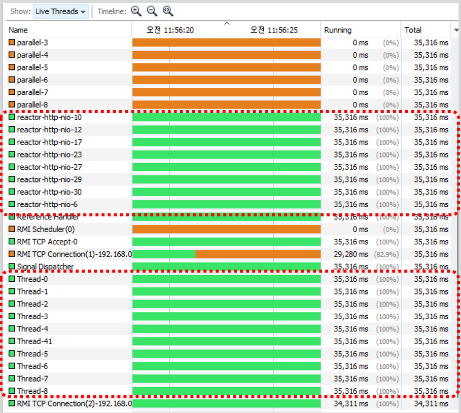
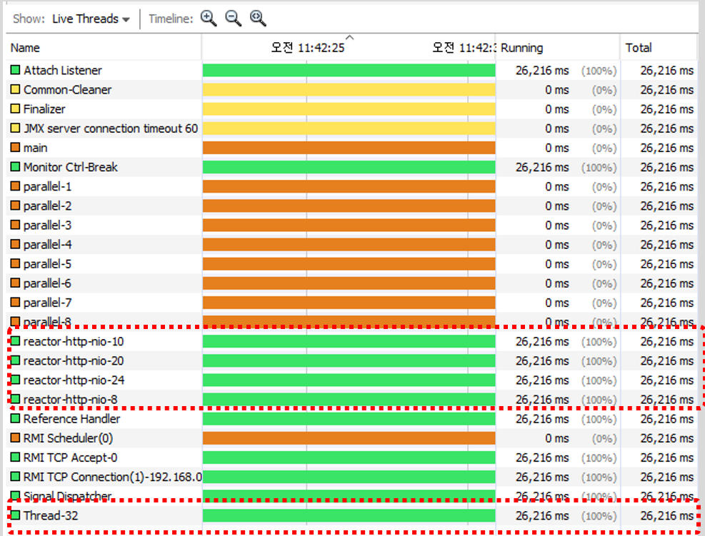

# 대용량 파일을 대규모 트래픽으로 Azure Blob Storage Upload 샘플

수백 ~ 수기가 파일을 대규모로 Blob Storage로 업로드 할 때 OOM 현상을 방지하기 위해 Max Concurrency로 Thread를 통제하고 Buffer Stream으로 업로드를 처리하는 방식의 샘플

> 다른 업로드 샘플은 [MS Doc](https://docs.microsoft.com/en-us/java/api/overview/azure/storage-blob-readme?view=azure-java-stable)에서 참고할 것.

## Thread 갯수 통제

### BlobClient

* BlobClient: https://azuresdkartifacts.blob.core.windows.net/azure-sdk-for-java/staging/apidocs/com/azure/storage/blob/BlobClient.html
* `setMaxConcurrency` 값으로 Thread값을 통제할 수 있음. 병목을 막기 위해 Thread값과 reactor worker수를 동일하게 맞춰주는 것을 권고 (아래 `reactor.netty.ioWorkerCount` 참고)

```java
    System.setProperty("reactor.netty.ioWorkerCount", MAX_CONCURRENCY);

    BlobClient blobClient = new BlobClientBuilder()
                    .endpoint(ENDPOINT)
                    .sasToken(SAS)
                    .containerName(CONTAINER)
                    .blobName(BLOB)
                    .buildClient();

    ParallelTransferOptions parallelTransferOptions = new ParallelTransferOptions()
            .setBlockSizeLong(BLOCK_SIZE)
            .setMaxConcurrency(MAX_CONCURRENCY)
            .setMaxSingleUploadSizeLong(MAX_SINGLE_UPLOAD_SIZE);


    blobClient.uploadFromFile(file.getAbsolutePath(), parallelTransferOptions, null, null, AccessTier.HOT, null, null);
```



### BlockBlobClient와 BlobAsyncClient는 Single Thread로 고정

* BlockBlobClient: https://azuresdkartifacts.blob.core.windows.net/azure-sdk-for-java/staging/apidocs/com/azure/storage/blob/BlockBlobClient.html
* BLobAsyncClient: https://azuresdkartifacts.blob.core.windows.net/azure-sdk-for-java/staging/apidocs/com/azure/storage/blob/BlobAsyncClient.html
* `setMaxConcurrency` 값으로 Thread조절이 안됨. `reactor worker` 갯수만 아래의 설정으로 조절할 수 있음

```java
    System.setProperty("reactor.netty.ioWorkerCount", "4");
```



## Buffer Stream을 이용하여 Blob client로 파일 Upload

```java
    BlobOutputStream blobOutputStream = client.getBlobOutputStream(parallelTransferOptions, null, null, AccessTier.HOT, null);

    byte[] buffer = new byte[5 * Constants.MB]; // Buffer Size설정 

    FileInputStream fileInputStream = new FileInputStream(file);
    BufferedInputStream bufferedInputStream = new BufferedInputStream(fileInputStream);
    int length;

    while ((length = bufferedInputStream.read(buffer)) > -1) {
        blobOutputStream.write(buffer, 0, length);
    }

    blobOutputStream.close();
```

## 결론

Single Thread로 BlockBlobClient나 BlobAsyncClient를 사용하거나 Multi Thread로 BlobClient를 사용하고, 두 경우 모두 Buffer Stream으로 업로드를 수행해야 대용량 파일의 대규모 업로드 Request상황에서도 OOM 오류를 피할 수 있음.